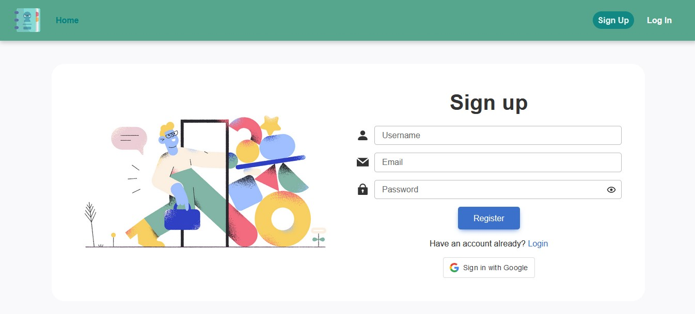
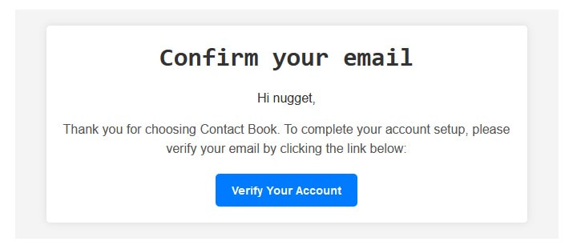
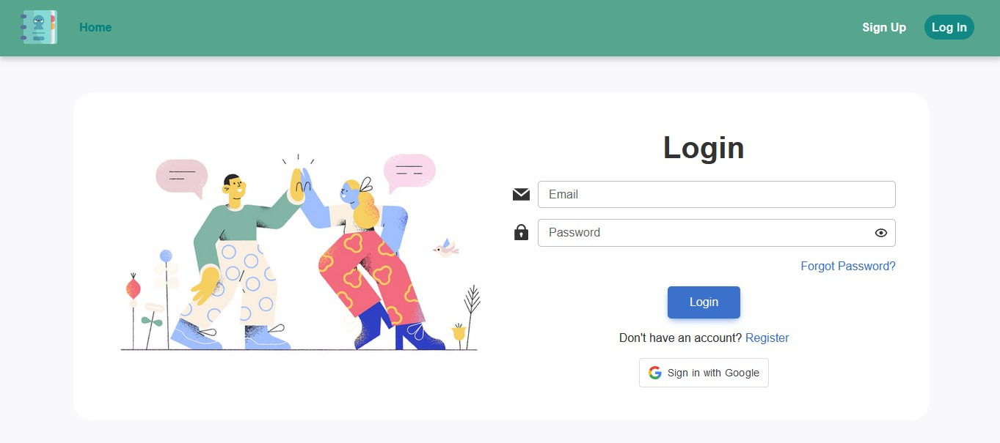
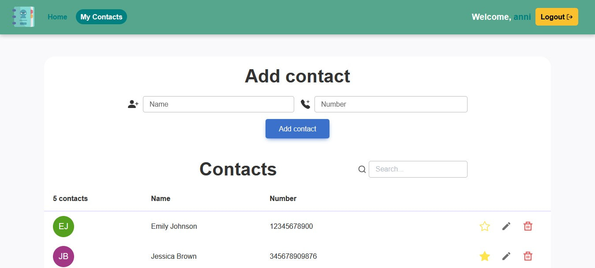
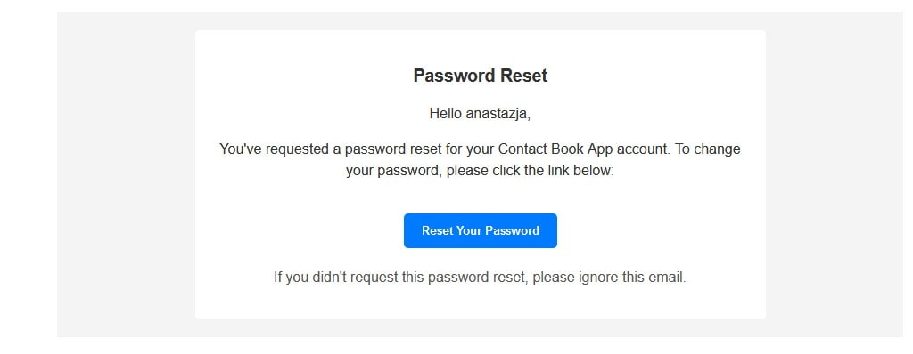
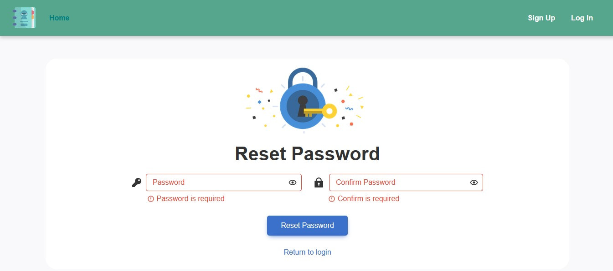
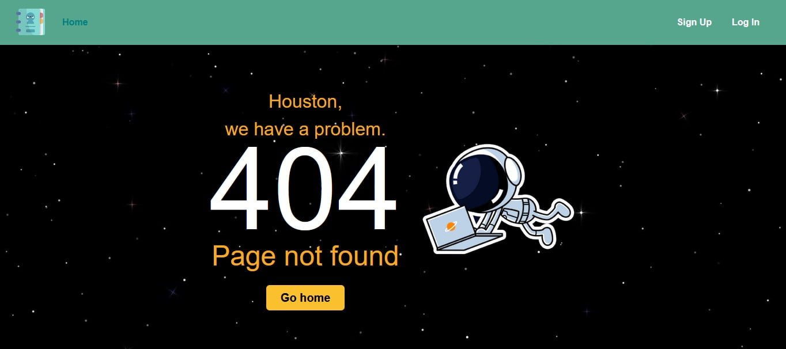

# Contact Book

Contact Book is a user-friendly application that allows users to register, login, and manage their contacts with ease. The application provides features such as adding, editing, and deleting contacts, as well as marking contacts as favorites. The application supports Google OAuth for user authentication. Users can also perform actions like sending recovery emails and changing passwords. The project is built using React, Redux, and other libraries for efficient state management and UI design.

## Table of Contents

- [Website content](#website-content)
- [Deploy](#deploy)
- [Installation](#installation)
- [Configuration](#configuration)
- [Technology stack](#technology-stack)
- [Contributing](#contributing)

## Website content

### Home Page

The Home Page is the landing page of the application, providing information about Contact Book's features and encourages users to get started with managing their contacts. It includes images and social media links, at the top of the page user can find a header with 2 links leading to the login and registration pages.


### Registration Page

Registration page contains user registration form with all the validation necessery. During sign up process you should indicate your username, email, and password. After the registration user should verify given email via recived letter. The link in the letter redirects user to the app login page.





### Login Page

Login process includes user check via given password and email.

After a successfull sign up, greeting notification appears at the top right corner. Near the username you can find a logout button allowing to sign out.



### Contacts Page

The Contacts Page displays the user's contacts, allows adding new contacts, and provides a search functionality.



### Recovery Page

The Recovery Page allows users to reset their passwords, using a token received via email, and by entering a new password and confirming it.





### Not Found Page

The Not Found Page renders a custom 404 error page when a user navigates to a non-existent page. It includes an astronaut image and provides a link to return to the home page.



## Deploy

The frontend part of the web-app is deployed on vercel platform.
[Live version of the app](https://contact-book-app-frontend.vercel.app) is avaliable by the web-address

```javascript
"https://contact-book-app-frontend.vercel.app";
```

## Installation

To run this project locally, follow these steps:

1.  Clone the repository:

```bash
  git clone  https://github.com/nastiaknik/contact-book-app-frontend.git
```

2.  Install dependencies:

```bash
  npm install
```

3.  Start the development server:

```bash
  npm start
```

This will start the application and you can view it in your browser at http://localhost:3000.

## Configuration

The application uses environment variables for configuration.
Create a .env file in the root directory with the following variables:

```bash
REACT_APP_GOOGLE_CLIENT_ID=your-google-client-id
```

## Technology stack

The key dependencies used in the project are:

- React: JavaScript library for building user interfaces.
- Redux: State management for predictable and scalable applications.
- Chakra UI: Building accessible and customizable UI components.
- React Toastify: Providing user feedback through notifications.
- Yup: Validating form inputs using schema validation.
- Typescript: Introducing static typing for enhanced code reliability.
- Styled Components: Styling library for React components.
- React Icons: Library for high-quality, customizable icons.
- Axios: HTTP client for making API requests.
- Formik: Library for handling forms.
- Google OAuth2: Google authentication.
- Vercel: Platform for deploying the frontend part of the web app.

<code></code>
<code></code>
<code></code>
<code></code>
<code></code>
<code></code>
<code></code>
<code></code>
<code></code>
<code></code>
<code></code>
<code></code>
<code></code>

## Contributing

If you have any suggestions, bug reports, or feature requests, please feel free to open an issue or create a pull request.
